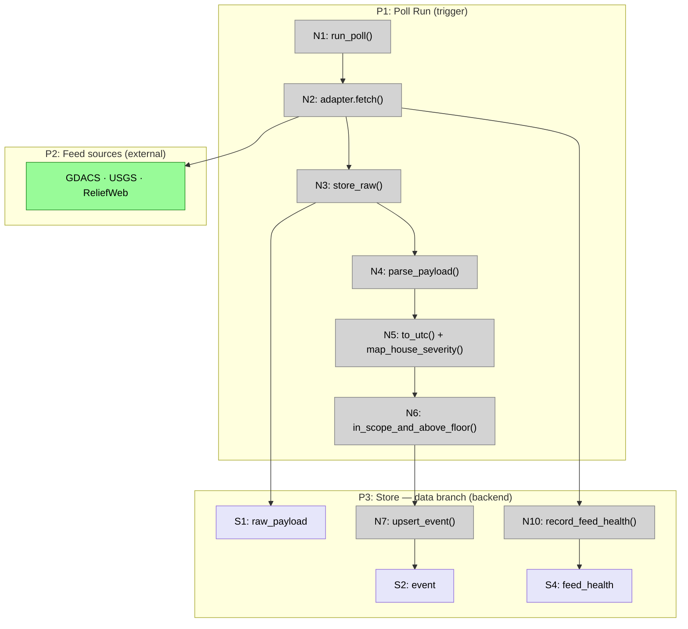
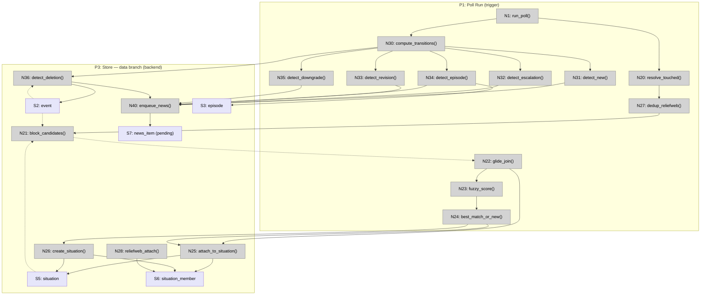
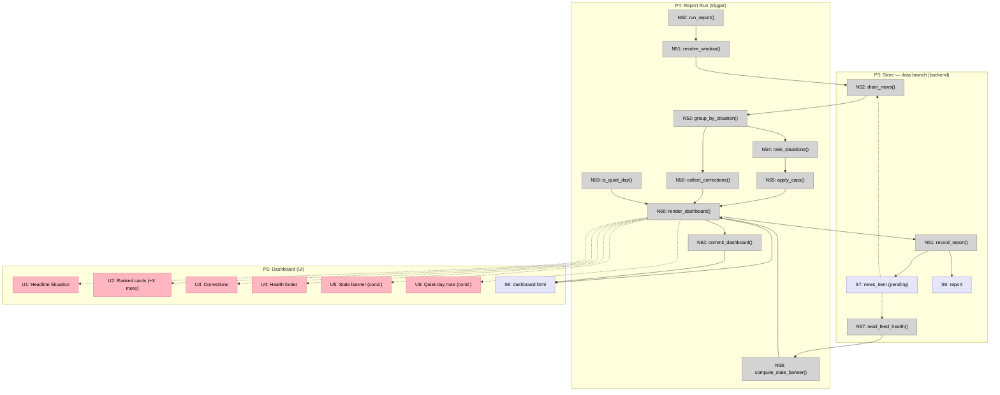
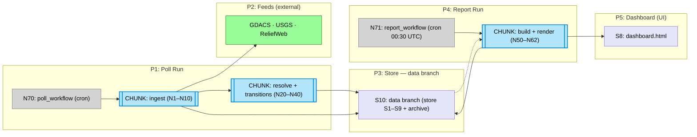

# HADR Monitor — Breadboard

Detailing Shape C (`SHAPING.md`, Detail C parts C1–C9) into concrete affordances
and wiring. This is a **headless pipeline**: most affordances are Code (N) and Data
Stores (S); the only UI (U) is the published `dashboard.html`. The tables are the
truth; the Mermaid diagrams are for humans.

Built piecemeal, one section per turn:

1. **Ingest** — Poll Run → adapters → archiver → normalizer → store ✅
2. **Resolution & change detection** — resolver → transition engine ✅ _(this section)_
3. **Report build & render** — report builder → renderer → Dashboard ✅ _(this section)_
4. **Scheduling, persistence & slicing** — C9 + full diagram + V1–V3 mapping ✅ _(this section)_

## Places

| # | Place | Description |
|---|-------|-------------|
| P1 | Poll Run (trigger) | The frequent GitHub Actions poll workflow; pulls feeds into the store |
| P2 | Feed sources (external system) | GDACS GeoJSON · USGS `all_day.geojson` · ReliefWeb `disasters` RSS |
| P3 | Store — `data` branch (backend) | SQLite event store + raw archive, persisted on the `data` branch (`ADR-0009`) |
| P4 | Report Run (trigger) | The 00:30 UTC report workflow; builds + renders + commits the report |
| P5 | Dashboard (UI) | `dashboard.html` — the published situation report |

---

## Section 1 — Ingest path (C1 · C2 · C3)

The Poll Run pulls each feed, archives the raw payload **before** parsing
(`ADR-0003`), normalizes to UTC + house severity, drops out-of-scope / sub-floor
records, and upserts survivors into the event store. No UI — this path is headless.

### Code Affordances

| # | Place | Component | Affordance | Control | Wires Out | Returns To |
|---|-------|-----------|------------|---------|-----------|------------|
| N1 | P1 | poller | `run_poll()` — orchestrates one poll: ingest, then resolve, then transitions | invoke (schedule) | → N2, → N20, → N30 | — |
| N2 | P1 | feed-adapter | `adapter.fetch()` — HTTP GET one feed (GDACS/USGS/ReliefWeb) | call | → P2, → N10, → N3 | → N3 |
| N3 | P1 | archiver | `store_raw()` — write raw body to `archive/{feed}/{fetched_at}` + insert row | call | → S1, → N4 | — |
| N4 | P1 | normalizer | `parse_payload()` — feed-specific parse → intermediate records | call | → N5 | — |
| N5 | P1 | normalizer | `to_utc()` + `map_house_severity()` — UTC-normalize time, map feed alert → house scale (`ADR-0005`) | call | → N6 | — |
| N6 | P1 | scope-filter | `in_scope_and_above_floor()` — AP bbox (`ADR-0007`) + severity floor + M≥6.5/≤70km fallback (`ADR-0008`) | call | → N7 | — |
| N7 | P3 | store | `upsert_event()` — upsert by `feed_key`, bump `last_seen_poll` | write | → S2 | — |
| N10 | P3 | store | `record_feed_health()` — write per-feed fetch outcome | write | → S4 | — |

### Data Stores

| # | Place | Store | Description |
|---|-------|-------|-------------|
| S1 | P3 | `raw_payload` | Archived raw fetch bodies + metadata (`feed, fetched_at, http_status`) |
| S2 | P3 | `event` | Tracked, normalized hazard Events (one row per feed record) |
| S4 | P3 | `feed_health` | Per-feed `last_success_at` + `last_status` (drives the stale banner, Section 3) |

### UI Affordances

_None — the ingest path is headless. The only UI (`dashboard.html`) appears in
Section 3._

### Wiring notes

- **Archive-before-parse:** `N2 → N3 → N4` is strict. The raw body is persisted to
  `S1` before any parsing, so a parser break never loses history (`ADR-0003`).
- **Health on every attempt:** `N2 → N10` fires on success *and* failure, so `S4`
  reflects the true last-success time even when a feed is down (`R6.2`).
- **Filtering is a gate, not a drop of history:** `N6` decides what reaches the
  event store `S2`, but everything already sits in the raw archive `S1` regardless.
- `N2 → P2` is the outbound HTTP call into the external feed system.

### Ingest diagram

---

## Section 2 — Resolution & change detection (C5 · C6)

Still inside the Poll Run, after ingest. First the **resolver** groups the events
touched this poll into Situations (per `SPIKE-entity-resolution.md`); then the
**transition engine** compares each entity's pre-poll state against its new state
and emits News candidates into a pending queue that the Report Run later drains.
Headless — no UI.

### Code Affordances — resolver (C5)

| # | Place | Component | Affordance | Control | Wires Out | Returns To |
|---|-------|-----------|------------|---------|-----------|------------|
| N20 | P1 | resolver | `resolve_touched()` — orchestrate resolution for events changed this poll | call | → N27, → N21 | — |
| N27 | P1 | resolver | `dedup_reliefweb()` — collapse RW reposts by GLIDE/link before matching (`R2.2`) | call | → N21 | — |
| N21 | P3 | resolver | `block_candidates()` — key by `hazard + geo-cell + time-bucket`, fetch candidate Situations/Events | call | → N22 | → N22 |
| N22 | P1 | resolver | `glide_join()` — shared GLIDE → deterministic attach | call | → N25, → N23 | — |
| N23 | P1 | resolver | `fuzzy_score()` — per-hazard tolerances (EQ ±30m/150km … RW ±72h/country) | call | → N24 | — |
| N24 | P1 | resolver | `best_match_or_new()` — best candidate above threshold, else new | call | → N25, → N26 | — |
| N25 | P3 | resolver | `attach_to_situation()` — add member link, recompute `house_severity`(max) + centroid | write | → S5, → S6 | — |
| N26 | P3 | resolver | `create_situation()` — new Situation from an unmatched Event | write | → S5, → S6 | — |
| N28 | P3 | resolver | `reliefweb_attach()` — attach a RW disaster to all Events sharing hazard+country+window (one-to-many, `R2.3`) | write | → S6 | — |

### Code Affordances — transition engine (C6)

| # | Place | Component | Affordance | Control | Wires Out | Returns To |
|---|-------|-----------|------------|---------|-----------|------------|
| N30 | P1 | transitions | `compute_transitions()` — per touched entity, diff pre-poll vs new state | call | → N31, → N32, → N33, → N34, → N35, → N36 | — |
| N31 | P1 | transitions | `detect_new()` — first seen this poll & above floor → News(new) | call | → N40 | — |
| N32 | P1 | transitions | `detect_escalation()` — house severity increased → News(escalation) | call | → N40 | — |
| N33 | P1 | transitions | `detect_revision()` — \|Δmag\|≥0.5 or GDACS colour change → News(revision) | call | → N40 | — |
| N34 | P1 | transitions | `detect_episode()` — TC/FL/VO new episode → News(episode) | call | → S3, → N40 | — |
| N35 | P1 | transitions | `detect_downgrade()` — house severity decreased while headlined → News(correction) | call | → N40 | — |
| N36 | P3 | transitions | `detect_deletion()` — not seen for K polls while in-window → set `lifecycle_status=deleted`, News(correction) | write | → S2, → N40 | — |
| N40 | P3 | transitions | `enqueue_news()` — write a News candidate to the pending queue | write | → S7 | — |

### Data Stores (added this section)

| # | Place | Store | Description |
|---|-------|-------|-------------|
| S3 | P3 | `episode` | Updates to fast-moving Events (cyclone track, flood re-issue) |
| S5 | P3 | `situation` | Cross-feed aggregate; `house_severity` = max across members |
| S6 | P3 | `situation_member` | Many-to-one Event → Situation links |
| S7 | P3 | `news_item` (pending) | Emitted News candidates awaiting the next report |

### Wiring notes

- **Resolution reads before it writes:** `N21` fetches candidates from `S2`/`S5`
  (Returns To `N22`); the write happens only at `N25`/`N26`/`N28`.
- **GLIDE-first, fuzzy-second:** `N22 → N25` on a deterministic GLIDE hit; otherwise
  `N22 → N23 → N24`, matching the spike's algorithm.
- **Deletion is a real transition, not absence:** `N36` reads `last_seen_poll` from
  `S2` and writes `lifecycle_status=deleted` — this is the mechanism that earns
  Shape C its R3.3 pass. The News it emits is a correction, not a silent drop.
- **The pending queue decouples polls from reports:** every poll appends to `S7`;
  the Report Run (Section 3) drains it for the window since the last report, so a
  missed report never loses News (`R6.1`).

### Resolution & change-detection diagram

---

## Section 3 — Report build & render (C7 · C8)

The Report Run fires at 00:30 UTC. It resolves the window since the last successful
report, drains the pending News queue, groups by Situation, ranks and caps, gathers
corrections, computes the stale banner from feed health, takes the quiet-day path
when there is no News, renders `dashboard.html`, then records the report and marks
the drained News as reported. This is the first section with UI.

### Code Affordances (C7 builder + C8 renderer)

| # | Place | Component | Affordance | Control | Wires Out | Returns To |
|---|-------|-----------|------------|---------|-----------|------------|
| N50 | P4 | reporter | `run_report()` — orchestrate the 08:30 SGT report | invoke (schedule) | → N51 | — |
| N51 | P4 | reporter | `resolve_window()` — since last successful report; first run = 24h (`ADR-0008`) | call | → N52 | — |
| N52 | P3 | reporter | `drain_news()` — read pending `news_item` within the window | read | → N53 | → N53 |
| N53 | P4 | reporter | `group_by_situation()` — collapse News into per-Situation entries | call | → N54, → N56 | — |
| N54 | P4 | ranker | `rank_situations()` — order by house severity + recency (`R7`) | call | → N55 | — |
| N55 | P4 | ranker | `apply_caps()` — top 8 Situations, top 5 updates each, "+X more" | call | → N60 | — |
| N56 | P4 | reporter | `collect_corrections()` — pull downgrade/deletion News into the corrections set (`R3.3`) | call | → N60 | — |
| N57 | P3 | reporter | `read_feed_health()` — read `feed_health` | read | → N58 | → N58 |
| N58 | P4 | reporter | `compute_stale_banner()` — flag feeds older than max(2×interval, 90 min) (`R3.2`) | call | → N60 | — |
| N59 | P4 | reporter | `is_quiet_day()` — true when the window has no News (`R3.1`) | call | → N60 | — |
| N60 | P4 | renderer | `render_dashboard()` — assemble the HTML from ranked entries, corrections, health, banner, quiet-note | call | → S8, → U1, → U2, → U3, → U4, → U5, → U6 | — |
| N61 | P3 | reporter | `record_report()` — insert `report` row + mark drained `news_item` as reported | write | → S9, → S7 | — |
| N62 | P4 | committer | `commit_dashboard()` — commit `dashboard.html` to `main` (`ADR-0009`) | call | → S8 | — |

### UI Affordances (P5 Dashboard)

| # | Place | Component | Affordance | Control | Wires Out | Returns To |
|---|-------|-----------|------------|---------|-----------|------------|
| U1 | P5 | dashboard | Headline Situation | render | — | — |
| U2 | P5 | dashboard | Ranked Situation cards (top 8, "+X more") | render | — | — |
| U3 | P5 | dashboard | Corrections section | render | — | — |
| U4 | P5 | dashboard | Health / heartbeat footer (per-feed last-fetch) | render | — | — |
| U5 | P5 | dashboard | Stale-data banner (conditional) | render | — | — |
| U6 | P5 | dashboard | Quiet-day note ("No significant changes since …", conditional) | render | — | — |

### Data Stores (added this section)

| # | Place | Store | Description |
|---|-------|-------|-------------|
| S8 | P5 | `dashboard.html` | The rendered report file, committed to `main` (the one committed HTML) |
| S9 | P3 | `report` | Published report rows (`published_at`, `window_start`, `window_end`) |

### Wiring notes

- **Window drives everything:** `N51 → N52` bounds the News drained. Because News
  lives in the pending queue (`S7`) until reported, a skipped run simply widens the
  next window — no gap (`R6.1`).
- **Quiet ≠ silent:** even when `N59` reports a quiet day, `N60` still renders — it
  emits `U6` (the quiet note) plus `U4` (the health footer). The report always
  publishes (`R3.1`).
- **Two conditional Us:** `U5` (stale banner) renders only when `N58` finds a stale
  feed; `U6` (quiet note) only when `N59` is true. Both are non-blocking additions
  to the same Place, not separate Places.
- **Mark-as-reported closes the loop:** `N61` writes the `report` row *and* flips the
  drained `news_item`s to reported in `S7`, so the next window starts clean.
- **Data flow into the UI:** ranked/capped entries (`N55`) feed `U1`/`U2`;
  corrections (`N56`) feed `U3`; health (`N57/N58`) feed `U4`/`U5`; quiet (`N59`)
  feeds `U6` — all via `N60`.

### Report & render diagram

---

## Section 4 — Scheduling, persistence & slicing (C9)

Two GitHub Actions crons drive everything, and both persist state through the
`data` branch because runners are ephemeral (`ADR-0009`). The poll workflow runs
frequently (ingest + resolve + transitions); the report workflow runs once at 00:30
UTC (build + render + commit).

### Code Affordances (C9)

| # | Place | Component | Affordance | Control | Wires Out | Returns To |
|---|-------|-----------|------------|---------|-----------|------------|
| N70 | P1 | ci | `poll_workflow` — frequent cron: checkout `data`, poll, commit store+archive | invoke (cron) | → N72, → N1, → N73 | — |
| N71 | P4 | ci | `report_workflow` — 00:30 UTC cron: checkout `data`, report, commit dashboard | invoke (cron) | → N72, → N50, → N62 | — |
| N72 | P3 | ci | `checkout_data_branch()` — load SQLite store + raw archive from `data` | read | → S10 | → N1, → N50 |
| N73 | P3 | ci | `commit_data_branch()` — persist store + pruned rolling archive back to `data` | write | → S10 | — |
| N74 | P1 | feed-adapter | `backoff()` — exponential backoff on feed error; keep last-good (`R6.2`) | call | → N2 | — |
| N75 | P1 | feed-adapter | `reliefweb_budget()` — cap ReliefWeb calls per run (`R6.3`) | call | → N2 | — |

### Data Stores (added this section)

| # | Place | Store | Description |
|---|-------|-------|-------------|
| S10 | P3 | `data` branch (git) | The persistence substrate — the SQLite DB (`S1–S9`) + rolling raw archive committed between runs |

### Wiring notes

- **The `data` branch is the only thing that survives a runner:** every workflow
  begins at `N72` (checkout) and the poll workflow ends at `N73` (commit). All of
  `S1–S9` physically live inside `S10`.
- **Backoff & budget wrap the adapter:** `N74`/`N75` gate `N2` so one flaky or
  rate-limited feed neither fails the run nor blows the ReliefWeb cap.
- **Two crons, one store:** the poll workflow writes the store; the report workflow
  reads it and writes only `dashboard.html` to `main`. Run-state churn stays off
  `main`.

### Full system (chunked overview)

---

## Slicing — V1 to V3

The affordances group into the three vertical slices from `prd.html` / `docs/PRD.md`.
Each ends in a demo-able `dashboard.html`. Forward wires to later slices are stubs
until built.

| # | Slice | Mechanism (parts) | Demo |
|---|-------|-------------------|------|
| **V1** | Skeleton report, one feed | C1(GDACS)·C2·C3·C4·C7·C8 | "This morning's AP GDACS Serious+ events as a ranked `dashboard.html`." |
| **V2** | Diff engine + Situations, all 3 feeds | C1(USGS/RW)·C5·C6 | "Replay a two-run fixture day — the second report shows only what changed; a quiet run shows just the heartbeat." |
| **V3** | Corrections, resilience & schedule | C6(corrections)·C9 | "Worst-day fixture yields a correction + a stale banner; the scheduled workflow runs unattended and commits the report." |

### V1 — Skeleton report, one feed

| Kind | Affordances |
|------|-------------|
| Code | N1, N2 (GDACS), N3, N4, N5, N6, N7, N10, N50, N51, N54, N55, N60, N61 |
| UI | U1, U2, U4 |
| Stores | S1, S2, S4, S8, S9 |

_V1's report ranks current above-floor Events directly from `S2`; the News queue
(`S7`) and `drain_news` (`N52`) arrive in V2, so V1 has no diffing (first run =
whole window)._

### V2 — Diff engine + Situations, all three feeds

| Kind | Affordances |
|------|-------------|
| Code | N2 (USGS + ReliefWeb), N20, N21, N22, N23, N24, N25, N26, N27, N28, N30, N31, N32, N33, N34, N40, N52, N53, N59 |
| UI | U6 (quiet-day note) |
| Stores | S3, S5, S6, S7 |

_Now the report drains News (`N52`) instead of ranking raw Events; `N54/N55/N60`
are rewired to consume grouped Situations._

### V3 — Corrections, resilience & the schedule

| Kind | Affordances |
|------|-------------|
| Code | N35, N36, N56, N57, N58, N62, N70, N71, N72, N73, N74, N75 |
| UI | U3 (corrections), U5 (stale banner) |
| Stores | S10 (`data` branch) |

_Adds the downgrade/deletion transitions and their corrections UI, the stale banner,
graceful backoff + ReliefWeb budget, and the two scheduled workflows with
`data`-branch persistence — the point at which the agent becomes unattended._

---

## Breadboard complete

All nine Shape C parts (C1–C9) are detailed into affordances with wiring, and every
affordance is assigned to a slice (V1–V3). Coverage check:

- **Every U has a source:** U1–U6 are all fed by `render_dashboard()` (`N60`).
- **Every N connects:** each Code affordance has Wires Out and/or Returns To.
- **Every S is read:** the stores feed the resolver, transition engine, report
  builder, or renderer; `S10` is the persistence substrate for all of them.

Ready for **Step E — Grill with docs (reconcile)**: confirm `CONTEXT.md`,
`docs/PRD.md`, and the ADRs still agree with this breadboard, and capture anything
new.
